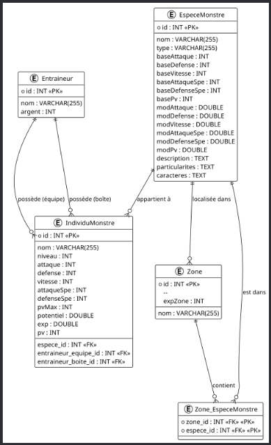

#  Compte Rendu Kotlin Monster



## 🧱 SPRINT 1 : Le Noyau du projet
Ce premier sprint avait pour but de poser les bases du projet Kotlin Monster, un mini-jeu inspiré de Pokémon, développé en Kotlin.
L’objectif principal était de créer la structure du projet, les classes principales (Monstre, Entraîneur, etc.) et d’effectuer les premiers tests de fonctionnement en console.

### 📘 Prompts utilisés

« Aide-moi à structurer le projet Kotlin Monster avec les classes principales Monstre, Entraineur et Attaque. »
→ ChatGPT m’a proposé une structure claire avec des classes bien séparées et des constructeurs adaptés.

« Donne-moi un exemple de fonction de combat entre deux monstres en Kotlin. »
→ J’ai obtenu un code de base que j’ai ensuite adapté pour gérer les dégâts, les PV restants et les tours de combat.

### ⚙️ Réalisations

- Création du projet Kotlin dans IntelliJ IDEA

- Définition des classes principales : Monstre, Attaque, Entraineur.

- Test initial du système de combat dans le terminal

- Vérification du bon déroulement des tours et des points de vie

## 🔥 SPRINT 2 : Module Éléments et Technique

Ce sprint consistait à enrichir le projet en ajoutant les types élémentaires (Feu, Eau, Plante, etc.) et les attaques techniques.
Cela permettait d’ajouter des avantages et désavantages selon les types, pour donner plus de profondeur au gameplay.

### 📘 Prompts utilisés

« Comment gérer les types élémentaires dans un jeu de monstres (feu, eau, plante) en Kotlin ? »
→ ChatGPT m’a conseillé d’utiliser une enum class pour représenter les éléments.

« Montre-moi comment appliquer un multiplicateur de dégâts selon le type d’attaque et de défense. »
→ J’ai intégré une fonction calculerDegats() prenant en compte les affinités entre types.

### ⚙️ Réalisations

- Création du module Element.kt avec les différents types élémentaires

- Ajout des attaques élémentaires et du calcul de dégâts selon le type

- Premier équilibrage des statistiques de base

- Tests en console avec mes premières espèces :
🌱 Springleaf (type Graine)
🔥 Flamkip (type Animal)
💧 Aquamy (type Météo)

## 🌆 SPRINT 2 (bis) : Module Évolution, Ville et Arène

Dans ce sprint, j’ai travaillé sur les mécaniques d’évolution des monstres, la gestion de la ville et l’ajout de l’arène permettant les combats officiels entre dresseurs.

### 📘 Prompts utilisés

« Comment faire évoluer un monstre quand il atteint un certain niveau en Kotlin ? »
→ ChatGPT m’a proposé un système basé sur un seuil de niveau et un mapping vers une nouvelle espèce.

« Comment structurer un système de villes et d’arènes dans un jeu texte ? »
→ Le modèle proposé m’a permis de créer une navigation entre zones et d’ajouter une arène fonctionnelle.

### ⚙️ Réalisations

- Ajout d’un système d’évolution : les monstres changent d’espèce au niveau requis

- Création de la classe Ville et de la classe Arène

- Ajout des classes CombatMonstre et CombatDresseur pour gérer les affrontements

- Création du dresseur champion et des dresseurs adversaires

- Test fonctionnel complet :
🚶‍♂️ Aller jusqu’à la ville
🏟️ Combat dans l’arène (victoire contre le champion)

## 💾 SPRINT 3 : Base de Données & DAO

Ce sprint était consacré à la connexion du jeu avec une base de données MySQL, via JDBC, et à l’implémentation des DAO (Data Access Object).
Ces DAO permettent d’isoler la logique d’accès aux données et de manipuler les entités directement depuis Kotlin.

💾 Création des tables SQL
``` sql
CREATE TABLE Entraineurs(
                            id INTEGER PRIMARY KEY AUTO_INCREMENT,
                            nom VARCHAR(255),
                            argents INTEGER);
```


📝 Explication :
Cette table stocke les informations de base des entraîneurs (leur identifiant, nom et argent disponible).
```
CREATE TABLE EspeceMonstre (
                               id INT PRIMARY KEY AUTO_INCREMENT,
                               nom VARCHAR(255) NOT NULL,
                               type VARCHAR(255) NOT NULL,
                               baseAttaque INT NOT NULL,
                               baseDefense INT NOT NULL,
                               baseVitesse INT NOT NULL,
                               baseAttaqueSpe INT NOT NULL,
                               baseDefenseSpe INT NOT NULL,
                               basePv INT NOT NULL,
                               modAttaque DOUBLE,
                               modDefense DOUBLE,
                               modVitesse DOUBLE,
                               modAttaqueSpe DOUBLE,
                               modDefenseSpe DOUBLE,
                               modPv DOUBLE,
                               description TEXT,
                               particularites TEXT,
                               caracteres TEXT
);

```
📝 Explication :
Cette table contient toutes les espèces de monstres disponibles dans le jeu, avec leurs statistiques de base et leurs descriptions.
```
CREATE TABLE IndividuMonstre (
                                 id INT PRIMARY KEY AUTO_INCREMENT,
                                 nom VARCHAR(255),
                                 niveau INT,
                                 attaque INT,
                                 defense INT,
                                 vitesse INT,
                                 attaqueSpe INT,
                                 defenseSpe INT,
                                 pvMax INT,
                                 potentiel DOUBLE,
                                 exp DOUBLE,
                                 pv INT,

                                 espece_id INT,
                                 entraineur_equipe_id INT,
                                 entraineur_boite_id INT,

                                 CONSTRAINT fk_espece
                                     FOREIGN KEY (espece_id)
                                         REFERENCES EspeceMonstre(id)
                                         ON DELETE CASCADE,

                                 CONSTRAINT fk_entraineur_equipe
                                     FOREIGN KEY (entraineur_equipe_id)
                                         REFERENCES Entraineurs(id)
                                         ON DELETE SET NULL,

                                 CONSTRAINT fk_entraineur_boite
                                     FOREIGN KEY (entraineur_boite_id)
                                         REFERENCES Entraineurs(id)
                                         ON DELETE SET NULL
);
```
📝 Explication :
Cette table représente les monstres individuels (liés à une espèce et à un entraîneur).
Les clés étrangères permettent de relier chaque monstre à son espèce et à son dresseur.
```
INSERT INTO Entraineurs (id, nom, argents)
VALUES
    (1, 'Bob', 10000),
    (2, 'Alice', 10000),
    (3, 'Clara', 10000);

INSERT INTO EspeceMonstre
(id, nom, type, baseAttaque, baseDefense, baseVitesse, baseAttaqueSpe, baseDefenseSpe, basePv,
 modAttaque, modDefense, modVitesse, modAttaqueSpe, modDefenseSpe, modPv,
 description, particularites, caracteres)
VALUES
    (1, 'springleaf', 'Graine', 9, 11, 10, 12, 14, 60,
     6.5, 9.0, 8.0, 7.0, 10.0, 14.0,
     'Un petit monstre espiègle au corps rond comme une graine. Il aime se cacher dans l’herbe haute et se dorer au soleil.',
     'Sa feuille sur la tête s’incline pour indiquer son humeur.',
     'Curieux, amical, un peu timide.'),

    (4, 'flamkip', 'Animal', 12, 8, 13, 16, 7, 50,
     10.0, 5.5, 9.5, 9.5, 6.5, 12.0,
     'Ce petit animal est toujours entouré d’une flamme dansante. Il déteste le froid et s’énerve facilement quand on tente d’éteindre son feu.',
     'Sa flamme change d’intensité selon son niveau d’énergie.',
     'Impulsif, joueur, loyal.'),

    (5, 'pyrokip', 'Animal', 18, 12, 15, 22, 11, 70,
     12.0, 8.0, 11.0, 12.5, 8.0, 15.0,
     'Pyrokip, l’évolution de Flamkip. Son feu est devenu intense et ses flammes sont capables de fondre la pierre. Fier et courageux, il protège son dresseur à tout prix.',
     'Ses flammes changent de couleur selon son humeur : rouge vif en colère, dorées quand il est calme.',
     'Fier, protecteur, explosif.'),

    (7, 'aquamy', 'Meteo', 10, 11, 9, 14, 14, 55,
     9.0, 10.0, 7.5, 12.0, 12.0, 13.5,
     'Une créature vaporeuse qui ressemble à un petit nuage. Les gouttes qui tombent de son corps sont pures et rafraîchissantes.',
     'Fait légèrement baisser la température autour de lui quand il s’endort.',
     'Calme, rêveur, mystérieux.'),

    (8, 'laoumi', 'Animal', 11, 10, 9, 8, 11, 58,
     11.0, 8.0, 7.0, 6.0, 11.5, 14.0,
     'Un petit ourson au pelage soyeux. Il adore se tenir debout et brandir ses petites pattes comme s’il dansait.',
     'Son grognement est plus mignon qu’effrayant, mais il devient redoutable pour défendre ses amis.',
     'Affectueux, protecteur, gourmand.'),

    (10, 'bugsyface', 'Insecte', 10, 13, 8, 7, 13, 45,
     7.0, 11.0, 6.5, 8.0, 11.5, 10.0,
     'Un insecte à la carapace luisante qui se déplace par petits bonds. Il communique en faisant vibrer ses antennes.',
     'Sa carapace devient plus dure après chaque mue, augmentant sa défense.',
     'Travailleur, sociable, infatigable.'),

    (13, 'galum', 'Mineral', 12, 15, 6, 8, 12, 55,
     9.0, 13.0, 4.0, 6.5, 10.5, 13.0,
     'Un golem ancien sculpté dans la pierre. Ses yeux s’illuminent d’une lueur mystérieuse quand il se met en garde.',
     'Peut rester immobile pendant des heures, le faisant passer pour une statue.',
     'Sérieux, stoïque, fiable.');

INSERT INTO IndividuMonstre
(nom, niveau, espece_id, entraineur_equipe_id, attaque, defense, vitesse, attaqueSpe, defenseSpe, pvMax, pv, potentiel, exp)
VALUES
    ('Springleaf d\'Alice', 5, 1, 2, 9, 11, 10, 12, 14, 60, 60, 1.0, 0.0),
    ('Aquamy de Bob', 8, 7, 1, 10, 11, 9, 14, 14, 55, 55, 1.0, 0.0),
    ('Bugsyface de Bob', 6, 10, 1, 10, 13, 8, 7, 13, 45, 45, 1.0, 0.0),
    ('Galum de Clara', 7, 13, 3, 12, 15, 6, 8, 12, 55, 55, 1.0, 0.0),
    ('Flamkip de Clara', 5, 4, 3, 12, 8, 13, 16, 7, 50, 50, 1.0, 0.0);'

delete from Entraineurs where nom = 'Sacha';

```
### ⚙️ DAO et Connexion BDD

- Création des classes EntraineurDAO, EspeceMonstreDAO, IndividuMonstreDAO

- Ajout de la méthode findAll() pour chaque DAO

- Connexion à la base via le fichier BDD.kt

- Test de récupération des espèces et affichage dans Main.kt

- Vérification de la persistance après relance du programme

### 🧪 Test fonctionnel final

À la fin du développement, j’ai testé le scénario complet :

- Démarrage du jeu

- Exploration des zones et capture de monstres

- Déplacement jusqu’à la ville

- Combat dans l’arène contre plusieurs dresseurs

- Victoire finale contre le champion 🎖️

### 📘 Pour plus d’informations

➡️ Voir le fichier README.md pour la présentation complète du projet.